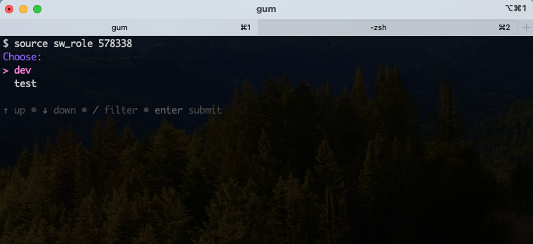
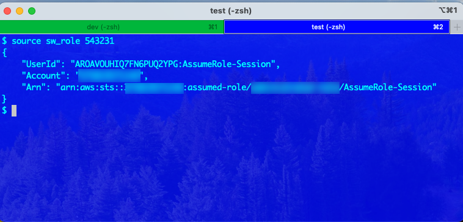

# sw_role

## Download

```
% git clone https://github.com/furuya02/sw_role.git
% cd sw_role
```

## Setting

|key|value|
|:--|:--|
|org_account|スイッチ元のアカウントID|
|org_name|スイッチ元のロール名|
|choose|スイッチするロールの名前を列挙|
|target_account|スイッチ先のアカウントID|
|target_role_name|スイッチ先のロール名|
|color_bg|ターミナルのバックグラウンド色|
|color_fg|ターミナルのテキスト色|
|color_title|ターミナルのタブの色|

```
# スイッチ元のアカウント情報
org_account=567856785678
org_name=my-role

# スイッチ先の選択
target=$(gum choose "test" "dev")
case $target in
    "test")
        target_account=123412341234
        target_role_name=dev-role
        color_bg=0000FF
        color_fg=00FFFF
        color_title=0000FF
        ;;
    "dev")
        target_account=345634563456
        target_role_name=dev-role
        color_bg=002000
        color_fg=FFFFFF
        color_title=00FF00
        ;;
```

## deploy

```
% chmod 755 ./sw_role
% sudo cp ./sw_role /usr/local/bin/sw_role

```

## Use

```
% source sw_role {MFA_CODE}
```

* 環境「dev」を選択した例




* 環境「test」を選択した例


